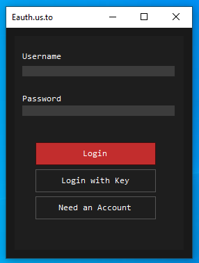

What is Eauth?
==============

https://eauth.us.to/ - Your #1 Free and Powerful Software Licensing Solution, Ultimately providing you with the most secure features and easy to use on an authentication system.    
  
Documentation
-------------

https://eauth.us.to/docs/


Configuration
-------------

Navigate to `Eauth.vb`, and fill these lines of code:

```vb
' Required configuration '
Private accountKey As String = "" ' Your account key goes here
Private applicationKey As String = "" ' Your application key goes here
Private applicationID As String = "" ' Your application ID goes here
Private applicationVersion As String = "1.0" ' Your application version goes here
```